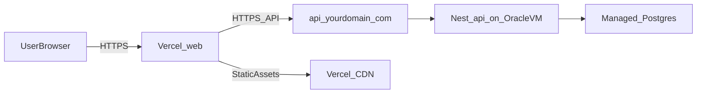

# EmotionTrade 배포 전략(Vercel + Oracle + Managed Postgres)

## 목표 아키텍처

- **Frontend**: Vercel에 `apps/web` 배포
- **Backend**: Oracle Cloud Always Free VM에 `apps/api`(Nest) 배포(Docker 권장)
- **Database**: **관리형 Postgres 무료 플랜**(Neon/Supabase 중 택1)
- **Domain**: `app.yourdomain.com`(Vercel) + `api.yourdomain.com`(Oracle)

## 핵심 결정(왜 이 조합이 좋은가)

- **무료/저운영**: DB를 VM에 같이 올리면 공짜이긴 하지만 백업/디스크/장애 대응이 부담이라, DB는 관리형으로 빼는 게 사이드 프로젝트에 유리합니다.

- **쿠키 인증 안정성**: 커스텀 도메인으로 `app/api`를 같은 eTLD+1 아래에 두면, httpOnly 쿠키/CSRF/CORS 이슈가 크게 줄어듭니다.

- **모노레포 배포 분리**: 한 레포여도 Vercel/Oracle에서 각각 `apps/web`, `apps/api`만 빌드/배포하도록 설정하면 됩니다.

## 배포 단위별 구체 전략

### 1) Frontend (Vercel)

- **Vercel Project**를 레포에 연결하고, **Root Directory를 `apps/web`**로 지정(또는 Build Command에서 `pnpm --filter web ...` 사용).

- **환경변수**: API 베이스 URL(예: `NEXT_PUBLIC_API_BASE_URL=https://api.yourdomain.com`)을 Vercel에 설정.

- **쿠키**: 프론트에서 `fetch` 시 `credentials: "include"`를 기본 정책으로 사용하도록 통일.

### 2) Backend (Oracle Cloud Always Free)

- Oracle Always Free VM(ARM) 1대에 **Docker로 Nest 실행**

- **Reverse Proxy**(Caddy 또는 Nginx)로:

- TLS 자동(Let’s Encrypt)

- `api.yourdomain.com` → 컨테이너 포트로 프록시

- **CI/CD**:

- GitHub Actions에서 `apps/api`를 빌드해 **GHCR(Docker image)**에 푸시

- VM은 주기/배포 시 이미지 pull 후 컨테이너 재시작(SSH)

### 3) Database (Managed Postgres: Neon/Supabase)

- **무료 플랜**: 연결 제한/슬립/쿼터가 있으니 초기엔 충분

- Nest에서 `DATABASE_URL`(또는 host/port/user/pass) 기반으로 연결

- 최소한의 운영:

- 마이그레이션/스키마는 레포의 SQL로 관리(이미 `apps/api/src/core/database/sql/` 존재)

### 4) 인증/보안 체크리스트(쿠키 기반)

- `api.yourdomain.com`에서 발급하는 쿠키는:

- **Domain**: `.yourdomain.com`

- **Secure**: `true`

- **HttpOnly**: `true`

- **SameSite**: 기본은 `Lax`로 시작(동일 사이트 서브도메인 전제)

- CORS:

- Origin: `https://app.yourdomain.com`

- Credentials: `true`

- CSRF:

- 쿠키 기반이면 CSRF 대책(더블서밋 토큰 등) 여부를 정책으로 결정

## 어떤 파일/설정이 바뀌는지(작업 범위)

- Frontend 관련: `apps/web/package.json`, `apps/web/next.config.ts`(환경변수/리라이트 필요 시)

- Backend 관련: `apps/api` 쪽 Dockerfile/compose, 실행 스크립트, CORS/쿠키 설정(대개 `main.ts` 또는 auth 모듈)

- Infra/CI: `.github/workflows/*` (API 이미지 빌드/배포), 문서화(`README.md`)

## 운영 팁(무료 플랜 현실 대응)

- Oracle VM에는 **로그/모니터링 최소화**(disk pressure 방지)

- DB는 **관리형 백업/스냅샷** 기능 활용(가능한 플랜 한도 내)
